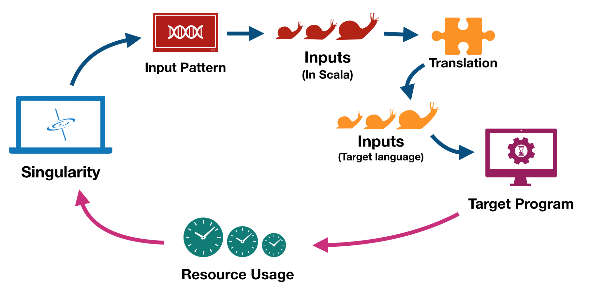
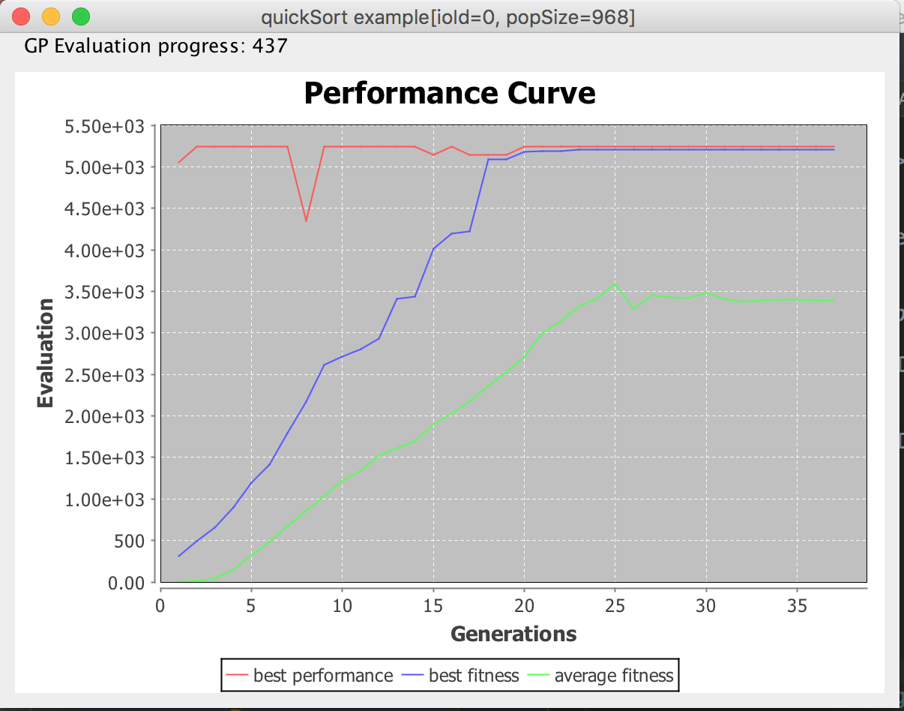
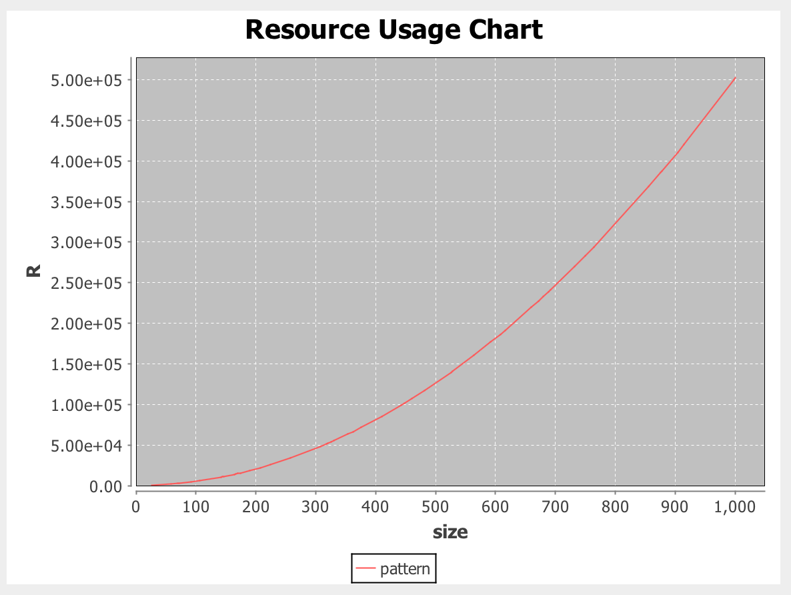

# Singularity

#### Pattern-based blackbox fuzzing framework for determining worst-case algorithmic complexities.


## Overview

**The closer your program gets to a singularity, the slower it runs.**

<p align="right"><strong> -- general theory of relativity </strong></p>

Singularity is an automatic fuzzing tool for generating inputs (called patterns) that demonstrates the maximal resource usage behavior of a given program.

The core idea behind Singularity is based on the observation that the **asymptotic worst-case behavior** of a given program is always triggered by inputs with some specific structural patterns. For example, to trigger the maximal running time of an insertion sort algorithm, the input array must be reversely sorted. Similarly, inserting a series of elements with the right pattern into a hash-based data structure can cause hash collisions and greatly decrease its performance (see [this github issue](https://github.com/google/guava/issues/3015)).

In order to efficiently search for such inputs, Singularity employs a Domain Specific Language (DSL) to compactly represents different input patterns and uses an optimization technique called [Genetic Programming](https://en.wikipedia.org/wiki/Genetic_programming) to synthesize input patterns with maximal resource usage inputs. This feedback-guided workflow is shown as follows:




## Usage

The recommended way is to include Singularity as a library into your Scala/Java project. Since Singularity is a blackbox fuzzing technique, it can be used to fuzz target programs written in any language, but the user is required to provide gluing code to translate the data structures outputted by Singularity into corresponding counterparts acceptable by the target program.

To follow the tutorial, either clone the github project or start a new Scala Project and include Singularity into your `build.sbt` file using:

```scala
libraryDependencies += "TODO"
```

## QuickSort Example

In this example, we will use Singularity to find the input pattern that maximizes the running time of a simple quickSort implementation. The source code can be found in [QuickSort.scala](src/benchmarks/scala/examples/QuickSort.scala).

### QuickSort Implementation and Instrumentation

First, let's write down a quickSort implementation with a simple pivot selecting strategy that always select the middle element as pivot.

```scala
  var counter = 0

  def quickSort(xs: IndexedSeq[Int]): IS[Int] = {
    counter += 1
    if(xs.length < 2) return xs

    val pivot = xs(xs.length/2) // selects the middle element as pivot
    val left = xs.filter(_ < pivot)
    val right = xs.filter(_ > pivot)
    val middle = xs.filter(_ == pivot)
    counter += xs.length
    quickSort(left) ++ middle ++ quickSort(right)
  }
```
Note that we use a global variable `counter` here to simulate how many lines of code have been executed. In more realistic use case, you will probably consider measure target programs' actual running time  or using an automatic tool to instrument the target program's source code. We provides two such instrumentation tools for both Java (see [this](https://github.com/grievejia/CostInstrument)) and C++ (see [this](https://github.com/grievejia/CostInstrument-llvm)) Programs.

### ProblemConfig

Having implemented the target program, we now need to write some gluing code to fully specify the input-feedback interface that Singularity can interact with.

```scala
  val quickSortProblem = ProblemConfig(
    problemName = "quickSort example",
    outputTypes = IndexedSeq(EVect(EInt)),
    resourceUsage = {
      case IndexedSeq(VectValue(vs)) =>
        val xs = vs.map(_.asInstanceOf[IntValue].value) //convert VectValue to IndexedSeq[Int]
        counter = 0
        quickSort(xs)
        counter
    },
    sizeF = {
      case IndexedSeq(VectValue(vs)) => vs.length
    }
  )
```

 * `outputTypes` gives the argument types of the target program. Since our quickSort implementation takes a Scala indexed integer sequence (`IndexedSeq[Int]`), `outputTypes` consists of only one element, `EVect(EInt)`, which is the equivalent type defined in the standard DSL.
(See more about DSL in [StandardSystem.scala](src/core/scala/singularity/StandardSystem.scala)).

 * `resourceUsage` specifies how to get resource usage as fuzzing feedback. Since we have specified the output type to be `EVect(EInt)`, during fuzzing time, Singularity will try to feed a vector of integers to the target program and need to receive the corresponding resource usage from the result of the lambda.

 * `sizeF` tells Singularity how to measure the size of any particular input.

### Running Singularity

After defining the fuzzing problem as a `ProblemConfig`, we still need to specify a few parameters related to Genetic Programming such as population size, crossover probability, number of internal sates, etc... Fortunately, we provide **Supernova**, a parameter sampling tool that automatically guesses (smartly) those parameters for you. So all you need to do is providing a random seed and a fuzzing size:

```scala
  def main(args: Array[String]): Unit = {
    val randomSeed = 0
    val fuzzingSize = 100
    val sizePolicy = FixedEvalSize(fuzzingSize)
    val runnerConfig = RunnerConfig().copy(randomSeed = randomSeed, useGUI = true)

    Supernova.standardSupernova.fuzzProblem(
      quickSortProblem,
      runnerConfig,
      execConfig = ExecutionConfig().copy(evalSizePolicy = sizePolicy),
      rand = new Random(randomSeed))
  }
```

Singularity wil then run GP using parameters randomly generated by Supernova and try to maximize the resource usage of an input vector under this length limit.

### Understanding the Results

After the fuzzing starts, a GUI will pop up, monitoring the performance of the found patterns. The best pattern of each generation will also be printed out in the command line.



There are three curves in the GUI: the red curve gives the best performance, i.e. the number returned by `resourceUsage` in `ProblemConfig`, of each generation. The blue curve represents the best fitness, a value calculated by multiplying performance with some penalty factors that penalize complex patterns. The green curve shows the average fitness of a whole generation.

As you can see from the Screenshot, Singularity easily found the pattern with maximal running time in just the second generation. (See the red curve), but the corresponding fitness is rather low (the blue curve), and that is because the found pattern is rather complex and hence has a large fitness penalty.

The best pattern in the first generation:

```
[O0: EVect(EInt)] -> #3  //A single output that outputs S3
*  //below are 4 internal states
[S0: EInt]{ seed: 224 ; iter: shiftBL(plus(bitAnd(9, 205), 215)) }
[S1: EInt]{ seed: 242 ; iter: #0 }
[S2: EVect(EInt)]{ seed: [245,35] ; iter: [] }
[S3: EVect(EInt)]{ seed: [] ; iter: #4 }
[S4: EVect(EInt)]{ seed: [23,234] ; iter: shift(prepend(118, append(#4, 227)), #0) }
```

Which generates inputs like this:

```
[23,234],
[342,247,458,451],
[57462,57686,57591,57802,57795,57571],
[57462,114806,115030,114935,115146,115139,114915,57571],
... ...
```

Such patterns are both hard to interpret and prune to *under-generalization* -- It may fail when extrapolate to larger sizes due to, for example, integer overflow.

But as the fuzzing continues, we see gradual and consistent fitness improvement. After about 60 generations (28 seconds on my laptop), Singularity converged to a much simpler pattern

```
[O0: EVect(EInt)] -> S4
*
[S0: EInt]{ seed: 0 ; iter: 0 }                 (unused state)
[S1: EInt]{ seed: 1 ; iter: S1 }
[S2: EVect(EInt)]{ seed: [] ; iter: #2 }        (unused state)
[S3: EVect(EInt)]{ seed: [] ; iter: prepend(0, shift(S4, inc(S1))) }
[S4: EVect(EInt)]{ seed: [] ; iter: append(S3, S1) }
```

And the inputs are also much more easy to understand:
```
[],
[1],
[0,1],
[0,3,1],
[0,2,3,1],
[0,2,5,3,1],
... ...
```

### Saving and Reading Patterns
During fuzzing, all console output along with important data like best patterns and best inputs are automatically saved into the directory `"project root"/results-running/"fuzzing task name and start time"`. By default, if there has not been any fitness improvement for more than 150 generations, Singularity will stop and move these results from `results-running` to `results`. You can change this stopping behavior by setting `maxNonIncreaseGen` in `ExecutionConfig`.

To read a pattern from its serialization file, simply use `FileInteraction.readMultiIndFromFile`. The following code shows how to restore a saved pattern from the quickSort example and extrapolate it out to larger sizes.

```scala
import singularity._
import singularity.visual.PatternPlot

object PatternRestoration {

  /** Restore and extrapolate the best input pattern found in the quickSort example */
  def main(args: Array[String]): Unit = {
    val config: ProblemConfig = QuickSort.quickSortProblem

    val patternFile = "results-running/quickSort example[ioId=0,seed=0](18-06-20-10:29:15)/bestIndividual.serialized"
    val individual = FileInteraction.readMultiIndFromFile(patternFile, StandardSystem.funcMap)

    PatternPlot.showResourceUsageChart(
      config,
      individual,
      sizeLimit = 1000, // extrapolation size
      plotPoints = 50 //number of data points in the displayed plot
    )
  }
}
```

The runningTime-inputSize relation is, as expected, a parabola.

