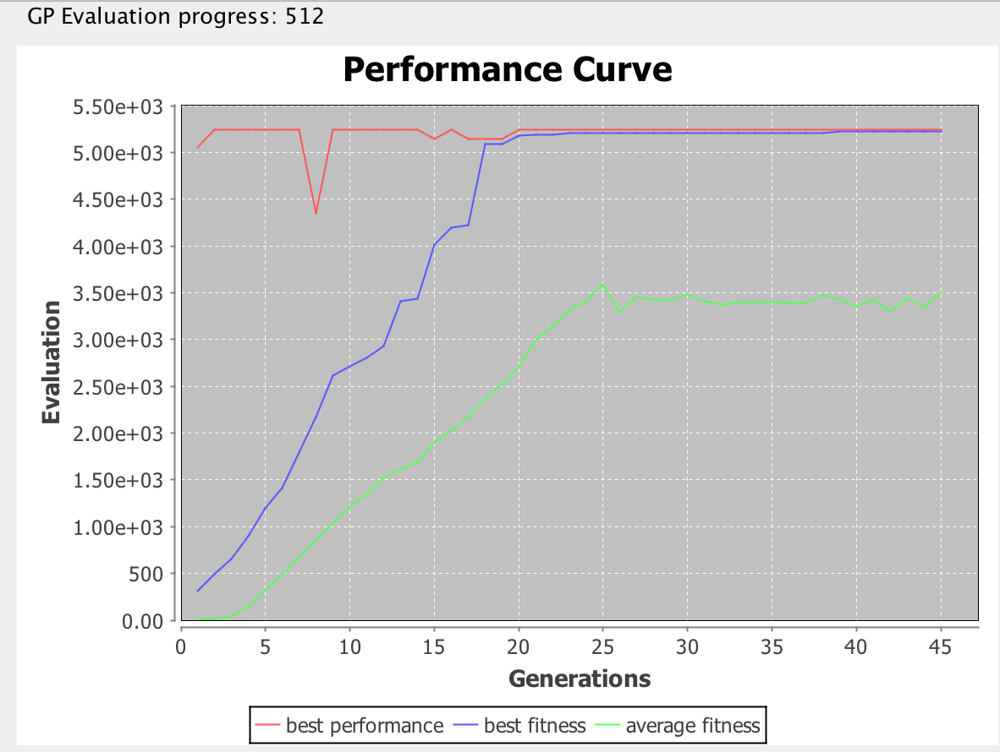

# Singularity

#### Pattern-based blackbox fuzzing framework for determining worst-case algorithmic complexities.


## Overview

**The closer your program gets to a singularity, the slower it runs.**

<p align="right"><strong> -- general theory of relativity </strong></p>

Singularity is an automatic fuzzing tool for generating inputs (called patterns) that demonstrates the maximal resource usage behavior of a given program.

The core idea behind Singularity is based on the observation that the worst-case behavior of a given program is normally triggered by inputs with some specific structural patterns. For example, to trigger the maximal running time of an insertion sort algorithm, the input array must be reversely sorted. Similarly, inserting a series of elements with the right pattern into a hash-based data structure can cause hash collisions and greatly decrease its performance (see [this github issue](https://github.com/google/guava/issues/3015)).

In order to efficiently search for such inputs, Singularity employs a Domain Specific Language (DSL) to compactly represents different input patterns and uses an optimization technique called [Genetic Programming](https://en.wikipedia.org/wiki/Genetic_programming) to synthesize input patterns with maximal resource usage inputs. This feedback-guided workflow is shown as follows:


## Usage

The recommended way is to include Singularity as a library into your Scala/Java project. Since Singularity is a blackbox fuzzing technique, it can be used to fuzz target programs written in any language, but the user is required to provide gluing code to translate the data structures outputted by Singularity into corresponding counterparts acceptable by the target program.

To follow the tutorial, either clone the github project or start a new Scala Project and include Singularity into your `build.sbt` file using:

```scala
libraryDependencies += "TODO"
```

## QuickSort example

In this example, we will use Singularity to find the input pattern that maximizes the running time of a simple quickSort implementation. The source code can be found in [QuickSort.scala](src/benchmarks/scala/examples/QuickSort.scala).

First, let's write down a quickSort implementation with a simple pivot selecting strategy that always select the middle element as pivot.

```scala
  var counter = 0

  def quickSort(xs: IndexedSeq[Int]): IS[Int] = {
    counter += 1
    if(xs.length < 2) return xs

    val pivot = xs(xs.length/2) // selects the middle element as pivot
    val left = xs.filter(_ < pivot)
    val right = xs.filter(_ > pivot)
    val middle = xs.filter(_ == pivot)
    counter += xs.length
    quickSort(left) ++ middle ++ quickSort(right)
  }
```
Note that we use a global variable `counter` here to simulate how many lines of code have been executed. In more realistic use case, you will probably consider using an automatic tool to instrument the target program's source code or even simply measure the running time. Singularity also comes with such an instrumentation tool whose usage can be found in //TODO.

Having implemented the target program, we now need to write some gluing code to fully specify the input-feedback interface that Singularity can interact with.

```scala
  val quickSortProblem = ProblemConfig(
    problemName = "quickSort example",
    outputTypes = IndexedSeq(EVect(EInt)),
    resourceUsage = {
      case IndexedSeq(VectValue(vs)) =>
        val xs = vs.map(_.asInstanceOf[IntValue].value) //convert VectValue to IndexedSeq[Int]
        counter = 0
        quickSort(xs)
        counter
    },
    sizeF = {
      case IndexedSeq(VectValue(vs)) => vs.length
    }
  )
```

`outputTypes` gives the argument types of the target program. Since our quickSort implementation takes a Scala indexed integer sequence (`IndexedSeq[Int]`), `outputTypes` consists of only one element, `EVect(EInt)`, which is the equivalent type defined in the standard DSL.
(See more about DSL in [StandardSystem.scala](src/core/scala/singularity/StandardSystem.scala)).

Since we have specified the output type to be `EVect(EInt)`, during fuzzing time, Singularity will try to feed a vector of integers to the target program and need to receive the corresponding resource usage as feedback, and we specify how to get such feedback as a lambda in `resourceUsage`.

Finally, we tell Singularity how to measure the size of any particular input in `sizeF`.

After defining the fuzzing problem as a `ProblemConfig`, we still need to specify several parameters related to Genetic Programming such as population size, tournament size, crossover probability, etc... Fortunately, we provide Supernova, a parameter sampling tool that automatically guesses (smartly) those parameters for you. All you need to do is providing a random seed and a fuzzing size: 

```scala
  def main(args: Array[String]): Unit = {
    val randomSeed = 0
    val fuzzingSize = 100
    val sizePolicy = FixedEvalSize(fuzzingSize)
    val runnerConfig = RunnerConfig().copy(randomSeed = randomSeed, useGUI = true)

    Supernova.standardSupernova.fuzzProblem(
      quickSortProblem,
      runnerConfig,
      execConfig = ExecutionConfig().copy(evalSizePolicy = sizePolicy),
      rand = new Random(randomSeed))
  }
```

Singularity wil then run GP using parameters randomly generated by Supernova and try to maximize the resource usage of an input vector under this length limit.

After the fuzzing starts, a GUI will pop up, monitoring the performance of the found patterns. The best pattern of each generation will also be printed out in the command line.



There are three curves in the GUI: the red curve gives the best performance, i.e. the number returned by `resourceUsage` in `ProblemConfig`, of each generation. The blue curve represents the best fitness, a value calculated by multiplying performance with some penalty factors that penalize complex patterns. The green curve shows the average fitness of a whole generation.

As you can see from the Screenshot, Singularity easily found the pattern with maximal running time in just the second generation. (See the red curve)