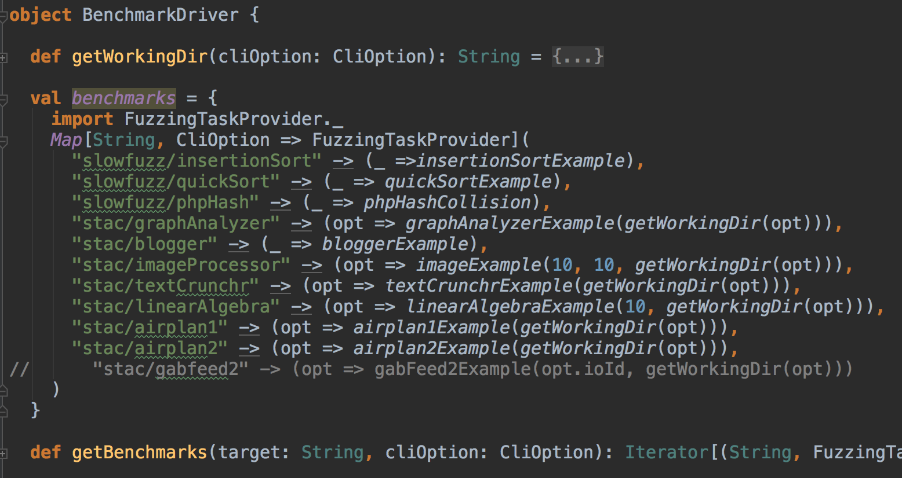

### Where to find all solved benchmarks


object BenchmarkDriver in `cli.BenchmarkDriver`





In order to define a new fuzzing task (referred to as "problem configuration" in our paper), we need a `FuzzingTaskProvider`, which is a trait (similar to an abstract class in Java) that defines the following methods. Only `task` and `sizeF` are required to be implemented, the other methods can be overwritten as needed.
```scala
trait FuzzingTaskProvider{
  protected def task: RunningFuzzingTask

  def sizeF: PartialFunction[IS[EValue], Int]

  def setupTask(task: RunningFuzzingTask): Unit = {}

  def teardownTask(task: RunningFuzzingTask): Unit = {}

  def displayValue: PartialFunction[IS[EValue], String] = {
    case v => v.toString
  }

  def saveValueWithName(value: IS[EValue], name: String): Unit = {
    ...
  }

  def run[A](f: RunningFuzzingTask => A): A = {
    ...
  }
}
```
### quickSortExample
where: `FuzzingTaskProvider.quickSortExample`

```scala
def quickSortExample = new FuzzingTaskProvider {
    import patbench.slowfuzz.QuickSort

    protected def task: RunningFuzzingTask = RunningFuzzingTask(
      outputTypes = IS(EVect(EInt)),
      resourceUsage = {
        case IS(VectValue(vec)) =>
          Cost.reset()
          val args = toIntVect(vec).map(i=>i.toString).toArray
          QuickSort.main(args)
          Cost.read()
      },
      gpEnv = sortingEnv
    )

    def sizeF = {
      case IS(VectValue(v)) =>
        v.length
    }
  }
```
function `quickSortExample` (we use `def` keyword to define functions in scala) defines how to create a new `FuzzingTaskProvider` anonymous class by implementing `task` and `sizeF` in the class body.
`sizeF` specifies the size metric to measure how big a task input is. Since the program of interest can accept multiple arguments in general, sizeF takes an input of type `IS[EValue]`.

`IS[T]` is just a convenient synonym for `IndexedSeq[T]` that is used through out this project.

Here since our task input is just a vector of integer, we use a pattern match in `sizeF`'s body to match an input of type `IS[EValue]` against pattern `IS(VectValue(v))`, then we use `v`'s length as size.


VectValue's definition:
```scala
case class VectValue(value: Vector[EValue]) extends EValue
```

Note that `Vector` is Scala's immutable indexed sequence data structure, while `VectValue` is an `EValue` which is defined in this project. The naming convention is that anything whose name followed by a "Value" is an `EValue`.

We also need to implement `task` to specify how to create a `RunningFuzzingTask`, in which we specify `outputTypes` and `resourceUsage`. Here `outputTypes` is the input types of the program of interest, it is called "outputTypes" in the sense that it is also the value type of the infinite patterns generated by our DSL programs (recurrent computation graphs).

`gpEnv` requires more explanation: it specifies the DSL we are using for this task. We have defined `sortingEnv` for multiple sorting examples.

```scala
def sortingEnv: GPEnvironment = {
    val constMap = makeConstMap(
      EInt -> IS(r => r.nextInt(12)),
      EVect(EInt) -> IS(_ => Vector())
    )

    val functions = IntComponents.collection ++ VectComponents.collection

    val stateTypes = constMap.keys.toIndexedSeq
    GPEnvironment(constMap, functions, stateTypes)
  }
```

`constMap` specifies how to create random constants of different types; these constants correspond to leaf noeds in the generated ASTs. `functions` specifies which functions (i.e. components) the GP algorithm uses as internal nodes to create ASTs.

Finally, `stateTypes` is an `IndexedSeq[EType]` that specifies how many internal states one recurrent computation graph should use and their corresponding types. In this example, we choose the keys of `constMap` as stateTypes, so it's just `IS(EInt, EVect(EInt))`.

Now we can run this example using `Runner.runExample` whose signature is
```scala
def runExample(taskProvider: FuzzingTaskProvider, seeds: Seq[Int], config: RunConfig = RunConfig.default,
                 useGUI: Boolean = true)
```
 the following code
```scala
runExample(FuzzingTaskProvider.quickSortExample, Seq(ioId))
```

`runExample` takes a `RunConfig` to overwrite the default parameters used by our GP algorithm.

```scala
case class RunConfig(populationSize: Int = 500,
                       tournamentSize: Int = 7,
                       evaluationTrials: Int = 1,
                       totalSizeTolerance: Int = 60,
                       singleSizeTolerance: Int = 30,
                       threadNum: Int = 1,
                       timeLimitInMillis: Int = 20000,
                       maxNonIncreaseTime: Int = 150
                      ){
```
Some parameters whose meaning requires extra explanations:

- `evaluationTrials`: The "window size" used for pattern evaluation. The last `evaluationTrials` ones are used to evaluate the performance of a pattern by taking their max.

- `totalSizeTolerance`: In our GP algorithm, fitness is calculated by multiplying the actual performance with a size penalty factor, so larger programs (with more AST nodes) would get more penalty. This parameters determines the penalty strength, once the total AST size gets closer to this value, the fitness drops rapidly.

- `singleSizeTolerance`: similar to `totalSizeTolerance` except that it determines how to penalize the individual AST for each internal state.

- `timeLimitInMillis`: The GP process is terminated once an input's evaluation exceeds this time. The timed out individual is automatically saved into log directories ($projectRoot/results/*).

- `maxNonIncreaseTime`: The GP process is also terminated once there hasn't been seen any performance increase after this number of generations.


See more examples in `object FuzzingTaskProvider`.