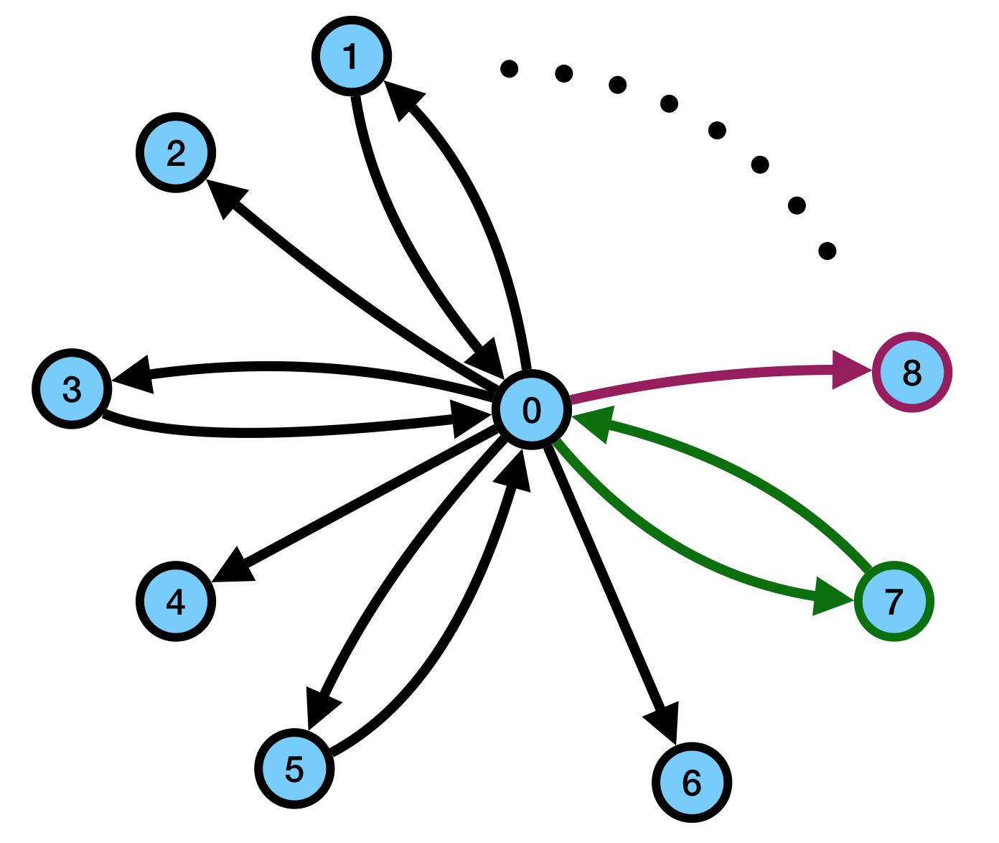

## Graph Components

We implement a generic graph data structure in Singularity. A graph of type `T` consists of an integer `n` recording the number of nodes and a list of edges, each containing an edge value of type `T`.

All graph-related components in our standard component set have a return type of `Graph[T]` and are listed below:

Name              | Description
------------------|-------------
`emptyGraph()`    |  create an empty graph
`addNode(g)`      |  add a new node to the graph `g`
`addEdge(g, v)`   |  add a new edge with two new endpoints and edge value `v` to the graph `g`
`growEdge(g, v, i)` |  add a new edge with one endpoint being an existing node `i`
`growSelfLoop(g, v, i)` |  add a new self loop to an existing node `i`
`bridgeEdge(g, v, i1, i2)` |  add an edge between two existing vertices `i1`, `i2`
`deleteEdge(g, i)`  |  delete an existing edge indexed `i` from graph `g`
`mergeGraph(g1, g2)` |  merge two graphs into one graph
`updateEdgeValue(g, v, i)`  |  update the `i`th edge's value in graph `g`
`addCompleteNode(g, v)`  |  add a new node, then connect it to all existing nodes with edge value `v`


## The JGraphT Example

Using these simple but expressive components, we were able to find the complexity vulnerability from one of the **maximal flow** implementation from JGraphT. We translated the input pattern Singularity found into self-contained Java code and reported it in [this bug report](https://github.com/jgrapht/jgrapht/issues/461).

The pattern we found corresponds to a RCG with 2 internal states, as shown below:

```
seed for g: addNode(emptyGraph())
seed for i: 0

updater for i: plus(i,2)
updater for g: growEdge(bridegeEdge(growEdge(g, 3, 0), 4, inc(i), i), 0, 0)

output1 (source index): 2
output2 (sink index): 1
output3 (graph): g
```

The graphs generated by this RCG look like this:



The RCG adds three new edges to the graph in each iteration. For example, suppose node 0~6 consist the current graph, in the next iteration, the updater first adds the outgoing edge 0->7 with edge weight 3; then, it adds the backward edge 7->0 with weight 4; finally, it creates the purple edge 0->8 with weight 0.

To trigger the n^5 complexity, the structure of the graph must be correct -- both those double edges (green ones) and single edges (purple one) are needed. And the source/sink index should be on env/odd indices, respectively. In addition, the purple edge must have a weight of 0. The outgoing green edge can have any positive weight `w`, but the backward green edge's weight must be `w+1`.


## The Guava Example

In the [Guava immutable collection bug](https://github.com/google/guava/issues/3015) we found, the pattern is much larger, containing 5 internal states with 33 AST nodes in total. Note also that each integer contant can have a value ranging from 0 to 500, so besides the 30 standard components, each integer value essentially corresponds to a new component in our DSL, which greatly extends the total search space and makes the optimization problem a lot more challenging. And such difficult optimization problems can only be efficiently addressed through feedback-guided techniques like Genetic Programming.


```
type of s0, s1: Int
type of s2, s3: Pair[Int]
type of s4: List[Pair[Int]]

seed for s0: 244
seed for s1: 475
seed for s2: (271, 212)
seed for s3: (239, 26)
seed for s4: []

updater for s0: 170
updater for s1: plus(plus(bitOr(times(times(99, 302), 486), 475), 142), dec(s1))
updater for s2: mkPair(pair2(s2), bitShift(s1, 353))
updater for s3: s2
updater for s4: append(s4,s2)

output: s4
```

The generated inputs are much more complex and less comprehensible, but they ultilize the weakness underlying Guava's hash smearing function and triggered an n^2 running-time complexity. The developers [changed their hash map implementation](https://github.com/sebasjm/guava/commit/604ee482b59af64be897d6e3350690790f9feccf) in the newer version because of this bug report.